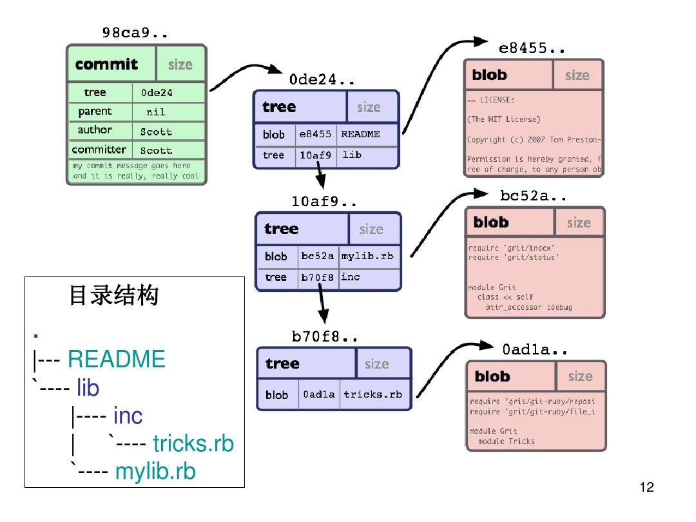

# 简介

 Git 和其它版本控制系统(包括 Subversion 和近似工具)的主要差别在于 Git 对待数据的方法。

- 大部分版本控制系统，例如(CVS、Subversion、Perforce、Bazaar 等等)，采用增量文件系统，存储每个文件版本的差异；

-   Git 更像是把数据看作是对小型文件系统的一组快照。 每次你提交更新，或在 Git 中保存项目状态时，它主要对当时的全部文件制作一个快照并保存这个快照的索引。 为了高效，如果文件没有修改，Git 不再重新存储该文件，而是只保留一个链接指向之前存储的文件；如果文件发生修改，Git 将存储该文件全部内容

  

<center>增量文件系统</center>


<center>快照文件系统</center>

# 存储原理

## 目录结构

```shell
$ tree .git
.git
├── HEAD
├── config
├── description
├── index
├── hooks
│   ├── applypatch-msg.sample
│   ├── commit-msg.sample
│   ├── fsmonitor-watchman.sample
│   ├── post-update.sample
│   ├── pre-applypatch.sample
│   ├── pre-commit.sample
│   ├── pre-push.sample
│   ├── pre-rebase.sample
│   ├── pre-receive.sample
│   ├── prepare-commit-msg.sample
│   └── update.sample
├── info
│   └── exclude
├── objects
│   ├── 8d
│   │   └── 0e41234f24b6da002d962a26c2495ea16a425f
│   ├── info
│   └── pack
└── refs
    ├── heads
    └── tags
```

- `description` 文件仅供 GitWeb 程序使用。 
- `config` 文件包含项目特有的配置选项。
- `info` 目录包含一个全局性排除文件，用以放置那些不希望被记录在 .gitignore 文件中的忽略模式。 
- `hooks`目录包含客户端或服务端的钩子脚本，这些我们暂时都无需关心。
- HEAD 文件：文件指示目前被检出的分支
- （尚待创建的）index 文件，
- objects 目录、refs 目录。 这些条目是 Git 的核心组成部分。 objects 目录存储所有数据内容(hash)；refs 目录存储指向数据（分支）的提交对象的指针（commit hash）；HEAD (refs目录内的分支名)；index 文件保存暂存区信息(git ls-files --stage命令查看当前暂存区信息)。

## object对象

object对象包括Blob对象、Tree对象与Commit对象

- Blob对象：存储文件的内容
- Tree对象：存储目录结构
- Commit对象：用于存储版本信息



## git指针


# 命令

## git add

文件内容做一个hash 存成blob object