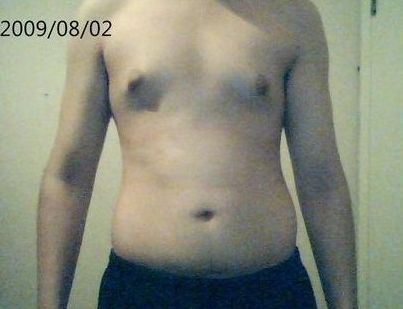

# 瘦胖子

这种身材体脂不低，但体重也不高。脂肪远大于肌肉，基础新陈代谢较低。**<u>通常BMI在正常范围内，但是体脂又高于正常范围</u>**(男生高于18%，女生高于25%)。通常瘦胖子还会有以下几个特点：

1. 别人不会说你胖，但你却会觉得自己胖且赘肉多（当然大部分女生都是这样看自己的 啦）

2. 四肢都没有特别明显的脂肪或显得很粗壮的，但你的腰围跟肚子上明显偏多的脂肪却会出卖你。（这个图可能稍微牵强了点）

## 原因

1. 不做增肌训练，或者训练强度不够，导致肌肉不多
2. 训练强度达标，但是蛋白质的摄入不够，导致肌肉无法增长
4. 有氧运动太多，导致肌肉一起流失
4. 因为长期没有运动的习惯以及不良生活方式导致体重虽然不大，但全身尤其是腹部往往囤积较多脂肪。

## 先减脂还是先增肌

1先减脂

　　- 优点：减脂的过程能够让你对体脂肪的控制有更加深切的体会，这对于以后的减脂会有所帮助，而且以低体脂的状态进入增肌阶段可以让你的增肌更加放得开

　　- 缺点：流失肌肉；身材几乎不会改善（仍然是“瘦胖子”）；由于本身体脂就不高，强行减掉的脂肪很有可能会反弹

2快速增肌&减脂

　　- 优点：增肌速度快；由于减脂和增肌的周期相对较短，能够更快获得增肌减脂的经验；有更多机会来调整饮食，学习如何控制饮食。

　　- 缺点：真正达到目标身材耗时太久；增肌期一直会有“我是不是太胖了”的想法；很多时间会花在恢复因为减脂而流失的肌肉上。

3长期保守增肌

　　- 优点：纯肌肉增长最高效；即使脂肪增长，身材也会因为增肌而变好；一旦达到目标体型，只需要维持或者保持缓慢的增肌和短期的减脂即可。

　　- 缺点：你需要有坚定的信念，在初期你经常会觉得这个过程太漫长，见不到效果，想要放弃。

增肌与减脂同时进行。

减脂

## 训练计划

### 热身

#### 目的

1. 让血液流向要锻炼的肌肉，让肌肉逐步适应大重量而不会导致疲劳；
2. 让肌肉充满活力，做好大重量组的准备；同时，保证不热身过度而感到筋疲力尽

#### 运动

平时重量的50% 12个

平时重量的60% 8个

平时重量的70% 4个

平时重量100%  1个

### [训练计划](https://mp.weixin.qq.com/s/FBc1GnM5eepSQYRvhzZ7xg)

| 时间 | 训练部位             |
| ---- | -------------------- |
| 周一 | 胸部、肱三头肌、腹部 |
| 周三 | 背部、肱二头肌、小臂 |
| 周五 | 腿部、肩部、腹部     |

#### 胸部

1. 杠铃卧推:6,8,10,12次                水平交叉夹胸4\*15次
2. 上斜卧推:6,8,10,12次                上斜交叉夹胸4\*15次
3. 臂前屈:6,8,10,12次                    下斜交叉夹胸4*15次
4. 负重俯卧撑:3组力竭                  弹力交叉俯卧撑:  每边各15次

#### 肱三头肌

1. **半程窄握卧推：**3组，次数渐降10rep -> 6rep -> 4rep

2. **负重臂屈伸三连：**3组，负重 -> 自重 ->弹力带辅助

3. **A 绳索过头臂屈伸：**3组，10-12rm，做到力竭

   **B 绳索下压：**3组，重量与3A一样， 做到力竭

4. **后侧步绳索下压：**2组，每组12rep，做到力竭
5. **弹力带哑铃碎颅式：**2组，每组15rep，做到力竭

#### 背部

1. 硬拉 - 2组（8rm，6rm）每组休息两分钟                   负重反手引体 -2组（4rm，8rm）

2. 硬拉 - 2组（4rm，4rm）每组休息30秒                      宽握引体 - 2组（自重，做到力竭）

3. 杠铃硬拉式划船 - 2组或3组（10-12rm）做8-10下

4. 单臂绳索下拉 - 10-12rm做到力竭                                

   攀岩式高位下拉- 10-12rm做到力竭（两者任选其一）

5.  脊柱伸展YW组合– 2组 每组14-20下（Y和W交替做）

6. 站姿杠铃耸肩– 1组 做到力竭

#### 肱二头肌

1. A 借力杠铃二头弯举：3组 做到力竭

   B 杠铃拖拽弯举：做到力竭

2. A 负重反手引体：3组 做到力竭

   B 顶峰收缩自重反手引体：做到力竭

3. 弹力带哑铃弯举：3组 做到力竭

4. 上斜哑铃弯举：2组 做到力竭

5. 哑铃弯举三连：2组 做到力竭，每个姿势8下

#### 小臂

1. **内旋手腕弯举**：2组，每组 12-15次

2. **手腕阶梯式弯举**：两组做到力竭

   2A 手腕旋转 x 1,2,3,4秒

   2B 正握弯举 x 1,2,3,4 rep

3. **尺骨\桡骨侧偏**：2组，每组12-15次

4. **小臂内旋\外旋**：2组，每组 12-15次

5. **握力组合：**两组做到力竭

   5A 握力挤压

   5B 握力挤压手腕屈伸

6. **静止小臂悬挂** – 1分钟

#### 腿部

热身A**：**深蹲   轻重量一直加到你训练重量的80%

热身B：触碰组——拿正式训练重量的110%做箱式深蹲*，一两个就行

1. **杠铃深蹲** – 4组：5RM、5RM、10RM、25RM   组间休息3分钟，休息期间可以做单杠悬挂30秒

2. **杠铃臀冲** – 4组：25RM、10RM、5RM、5RM

   **器械臀腿起**（GHR） - 4组：25RM、10RM、5RM、5RM （两者任选其一）

3. **A哑铃保加利亚分腿蹲（高低交替版本）** - 2组，每条腿10-12RM

   **B自重保加利亚分腿蹲（同样高低交替）** - 1组，做到力竭为止

4. **TKE后撤箭步蹲** - 2-3组，每组每条腿10-12RM

5. **高脚杯内收深蹲** - 2组，每组每条腿10-12RM

6. **弹力带侧步行走** – 1-2组，每组1-10下递增，总共55下（1+2+……+10=55）

#### 肩部

**肩膀热身/ 弹力带过头举：**两组，每组15下，每个动作停顿三秒钟

1. **杠铃过头举 / 倒立肩推：**4组：10下、8下、6下、6下

   做完四组之后加练一组**哑铃过头举** 或者是 **弹力带过头举**：15次 

2. **绳索三角肌拉伸三连**后束/中束/前束：2-3组：每组每个肌群7下

3. **A 借力单侧侧平举：**三组，做到力竭

   **B 借力单侧肩推：**三组，做到力竭

4. **绳索面拉/ 弹力带面拉：**三组，每组15下

#### 腹部

1. **孤立控制反向卷腹 30-60秒**

2. **坐姿举腿画圈 30-60秒**

   休息30秒

3. **坐姿肘碰膝卷腹 30-60秒**

4. **俯卧异侧肘碰膝 30-60秒**

   休息30秒

5. **橡树弹力带侧步走 30-60秒**
6. **单倍阻力弹力带卷腹下拉 30-60秒**
7. **平板支撑起 30-60秒**

## 饮食计划

问一问，是增肌还是减脂

任务：

- [ ] 组数与次数是否合适

- [ ] 先减脂还是先增肌--》饮食计划

- [ ] 热身如何热身

- [ ] 训练计划是否合理

- [ ] 熟悉动作

  

# 肌肉

了解肌肉的体态影响以及功能从而学习健身