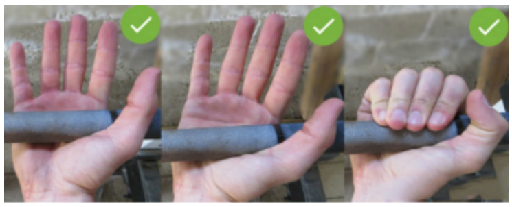
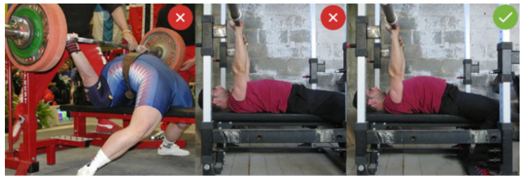

# 卧推

## [卧推细节](https://mp.weixin.qq.com/s?__biz=MzA3MDE5NDQxMQ==&mid=2649921198&idx=1&sn=59eea138954556dcbca1e62c6116edb9&chksm=86c6b32ab1b13a3c85904df933279afaf0afe1c89463021249f1611cdaa4f8fcf3d3d718de45&scene=21#wechat_redirect)

1. 上合适的杠铃片并用杠铃夹固定住。但当一个人训练时，可以不使用杠铃夹，这样杠铃倾斜的时候，杠铃片会掉落，从而保证不受伤。
2. 杠铃与板凳位于正中间从而确保在卧推的过程中，杠铃两边的力量平衡
3. 杠铃位于眼睛这个上方
4. 握距（大臂与躯干程75°）：确保杠铃在最低点，胳膊与躯干的角度在75°左右。注意千万不能在90°，因为此时肩关节达到最大活动限度，当杠铃到达最低点的时候，很容易造成肩关节损伤。。
5. 握法：不要空握，以免杠铃滑落。手腕不要弯，保证手腕垂直，用你的大小鱼际顶住杠铃，从而使手臂承受杠铃的重量，避免手腕受伤。正确的姿势，大拇指缠绕的方法。
6. 两脚：用力踩地面，臀部用力，感觉力量从脚向上传递，。（腿部驱动技术）
7. 手臂外旋：保证手臂与躯干的夹角，夹角太大会损伤肩膀，配合大拇指缠绕的方式
8. 下降点：胸部，刺激胸肌并保证小臂与地面垂直
9. 最高点：锁骨，刺激胸肌并保证小臂与地面垂直
10. 最重要的是**肩胛骨后缩下压**

<iframe width='100%' height='550' src="//player.bilibili.com/player.html?aid=13073525&cid=21459892&page=1" scrolling="no" border="0" frameborder="no" framespacing="0" allowfullscreen="true"> </iframe>
## 卧推致命错误

1. **卧推时双脚离地**

2. **尝试大重量卧推的时候没有人保护或不借用四方架**

3. **卧推下架和归架的移动速度过快**

4. 手腕疼：正确的办法是全握，手腕立直，中立位的方式推杠铃，用你的大小鱼际顶住杠铃。同时使用大拇指缠绕的方式

   

5. 过度的外展手臂

   

6. 杠铃运动轨迹

   

7. 卧推时没有挺胸

   

8. 臀部脱离卧推椅

## 疼痛

| 部位       | 原因                                                         |
| ---------- | ------------------------------------------------------------ |
| **肩膀痛** | 保持肩胛骨后缩下压 注意控制大臂外展幅度                   |
| **手肘疼** | 伸肘肌群和屈肘肌群的力量失衡。 保证从侧面看时前臂始终垂直于地面 热身不足 |
| **手腕疼** | 保持手腕中立，用你的大小鱼际顶住杠铃                         |

# 上斜卧推

1. 卧推凳30°
2. 肩胛骨后缩下压
3. 下落点锁骨上方

