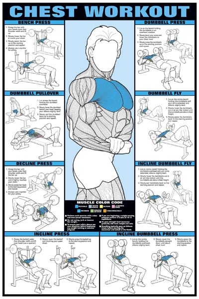
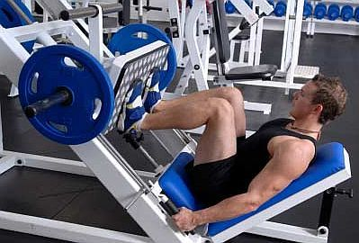
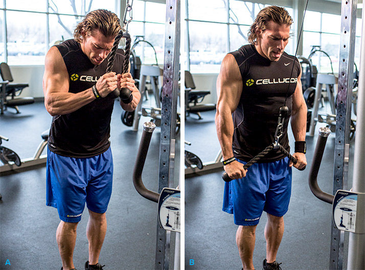

# 胸

## 胸大肌

所有肘部向身体前侧运动，或两肘在身体前侧靠拢的训练动作，都会练到胸肌。可以这样简单理解：平板卧推，着重训练胸肌中部；上斜板，着重训练胸肌上部；下斜板着重训练胸肌下部。

## 前锯肌

前锯肌，一头连接在肩胛骨上，一头连接在肋骨上。所以我们很容易想到，前锯肌一收缩，就是拽着肩胛骨往前跑。运动解剖学的术语，这个动作叫肩胛骨外展。

# 背部

## 背阔肌

| 宽度                                     | 厚度         |
| ---------------------------------------- | ------------ |
| 引体向上                                 | **哑铃划船** |
| 高位下拉（背要直，可以稍微向后仰一点。） | 坐姿划船     |
| 直臂下拉                                 |              |

1. 引体向上

   训练肌群。背阔肌，大圆肌，小园肌，肱二头肌。次要肌肉：三角肌后束，胸肌，腹肌，斜方肌等。**适当增加握的宽度，也更能增加对背阔肌的刺激**

   

2. **高位下拉**
   

3. **直臂下拉**

  

4. **哑铃划船**

4. **坐姿划船**
   

5. 硬拉
   屈腿硬拉比直腿硬拉要对下腰肌肉的刺激效果更好。

   

## 斜方肌训练

| 上   | 中       | 下       |
| ---- | -------- | -------- |
| 耸肩 | 反握划船 | 反握划船 |

1. 杠铃耸肩

   

2. 反握杠铃划船

# [腿部](https://zhuanlan.zhihu.com/yunjianshen)

## 股四头

股四头肌的训练动作其实不多，无非就是两类基本动作，

1. 蹲，各种蹲。在训练股四头肌的同时，都能同时训练到大腿后侧的肌肉，比如臀大肌、腘绳肌群。
2. 是腿屈伸，腿屈伸要用到联合器械。是基本上孤立训练股四头肌

### 蹲

#### 脚宽

- **两脚站得较宽**时，训练重点稍微偏向**股内侧肌**

- **两脚站得较窄**时，训练重点稍微偏向**股外侧肌**

#### 脚的位置

双脚踩的位置，靠近踏板下沿，对股四头肌训练效果较好。靠近上沿，则大腿后侧肌群发力较明显。

#### 低度

我个人的建议，深蹲不要蹲得过低。这是从保护膝关节的角度来说。深蹲时蹲得过低，股四头肌使髌骨贴紧股骨滑车。深蹲角度越大，此处的压应力越大，容易造成髌骨损伤或膝关节滑囊炎之类的问题。**越低对膝关节的影响越大**

### 腿屈伸

## 腘绳肌

训练腘绳肌的动作，主要是硬拉和腿弯举（下图）。另外，所有练臀部的动作，也都能训练到腘绳肌。深蹲时，腘绳肌也会参与稳定关节和维持动作，所以也可以得到一定程度的训练。

### 硬拉

硬拉动作，直腿硬拉，对腘绳肌刺激更大。屈腿硬拉，对臀大肌刺激更大些，这一点在讲臀大肌训练的时候我们讲过。

### 腿弯举

## 臀肌

## 小腿肌肉

腓肠肌与比目鱼肌

当膝关节屈的状态下，腓肠肌比较松弛，活跃性不强。这就是为什么，站姿提踵，骑驴提踵这类膝关节基本伸直的提踵动作，是训练腓肠肌的最好动作。

坐姿提踵，则偏重训练比目鱼肌。

# 肱三头肌

1. 绳索下拉

   

2. 双杠臂屈伸

   俯身练胸肌，直身练肱三头肌

   

   

# 肩部

## 三角肌前束

三角肌前束，一头连着胳膊大概中间的位置，一头连着锁骨，所以，只要是**大胳膊中间位置靠近锁骨的动作，都能训练三角肌前束**。三角肌前束的主要动作是推举和前平举。

我们知道，卧推也能顺便练到三角肌前束，因为卧推时，胳膊中间位置也靠近锁骨了。我们还知道，上斜板卧推，能更多用到三角肌前束。这样我们想象一下，上斜板卧推，倾斜的角度特别大的时候，上身快90度了，其实就成了推举了。这时候，胸肌就基本不用力了，主要靠三角肌前束。但如果上身坐的特别直，成了90度了，那么三角肌前束发力就会减少一些，中束发力就会增加。我们拿手掌丈量一下，也会发现，身子做的特别直，胳膊中部靠近锁骨的幅度就会减小。身子往后仰一仰，有点上斜板推举的意思，这时胳膊中部靠近锁骨的幅度就更大。

## 三角肌中束

只要是大胳膊靠近肩峰的动作，都能练到三角肌中束。侧平举不用说，大家都很熟悉。只说一点，侧平举练肩，不需要举得太高，肘部超过肩部后，斜方肌上部发力就增加了，成了主要练斜方肌了。

## 三角肌后束

1. 俯身平举

2. 绳索后束平拉

# 腹部

卷腹与举腿。

侧腹肌-身体侧着卷腹