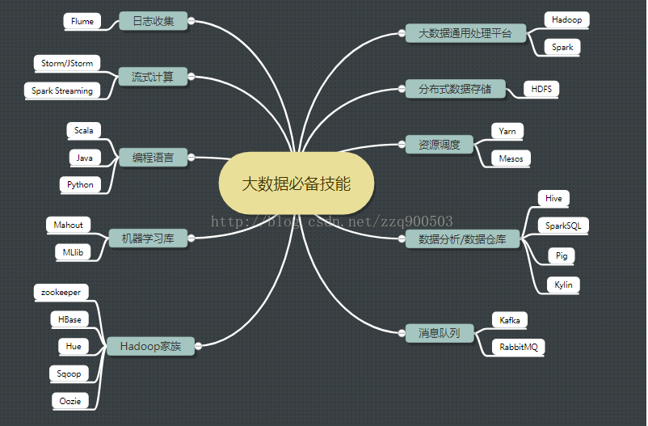

# 基础

**1 Java基础：**

视频方面：推荐毕老师《毕向东JAVA基础视频教程》。

学习hadoop不需要过度的深入，java学习到javase，在多线程和并行化多多理解实践即可。

书籍方面：推荐李兴华的《java开发实战经典》

**2 Linux基础：**

​    视频方面：（1）马哥的高薪Linux视频课程-Linux入门、

　　　        　（2）兄弟连的新版Linux视频教程、

​                     （3）老段的讲解鸟哥Linux基础+私房菜、

​                     （4）老男孩的Linux。

​         看的过程中，不可只看不同步操作，这是最危险的一件事！不需全部看完。如：基本的Linux操作系统官网下载、安装（命令行界面和图形界面）、基本命 令、网络配置、快照、VMtools工具安装、虚拟机的菜单熟悉等等。这是必须要首先完成的。之后，可回过来再根据需要使用到哪些，再来学习即可。当作工 具书！

​    书籍方面：

（1）《鸟哥的linux私房菜》,

（2）之后，进一步可以看书籍《鸟哥的服务架设篇》。

（3）Linux随身指南（4）老男孩Linux运维

系统学习只要多多实践，学习linux并不枯燥。

**3 hadoop书籍：**

（1）《Hadoop实战  (第1版) 陆嘉恒》、《Hadoop实战 (第2版) 陆嘉恒》

（2）《hadoop definitive guide 》，中文书名是《Hadoop权威指南（第1版）曾大聃译》，《Hadoop权威指南 (第2版) 周敏奇译》，《Hadoop权威指南 （第3版 ） 华东师范大学数据科学与工程学院译》

（3）Hadoop技术内幕：《深入解析Hadoop common和HDFS架构设计与实现原理》 蔡斌  

4）hadoop技术内幕：《深入解析YARN架构设计与实现原理》董西成  

（5）Hadoop技术内幕：《深入理解MapReduce架构设计与实现原理》 董西成 

（5）《Hadoop in Action》中文书名是《Hadoop实战》，

（6）《Hadoop应用开发技术详解    刘刚》 

 （7）《Hadoop 核心技术》翟周伟 

平常多看看hadoop的官网，虽然是官网，但尽量多学习计算机方面的单词，对后续学习帮助极大。

**4 Maven书籍：**

强烈推荐书籍：Maven实战   许晓斌著。目前是第一版 

**5、spark书籍：**

　　　　（1）《Spark大数据处理  技术、应用与性能优化   高彦杰》

　　　　（2）《深入理解Spark核心思想与源码分析   耿嘉安》

# 大数据技术板块划分

- 数据采集

  - flume kafka logstash filebeat ...

- 数据存储

  - mysql redis hbase hdfs ...
    - 虽然mysql不属于大数据范畴 但是我在这也列出来了，因为你在工作中离不开它

- 数据查询

  - hive impala elasticsearch kylin ...

- 数据计算

  - 实时计算
    - storm sparkstreaming flink ...
  - 离线计算
    - hadoop spark ...

- 其他框架

  - zookeeper ..

# 大数据学习步骤

1. linux基础和javase基础【包含mysql】
   - 这些是基本功，刚开始也不可能学的很精通，最起码要对linux中的一些基本的命令混个脸熟，后面学习各种框架的时候都会用到，用多了就熟悉了。javase的话建议主要看面向对象，集合，io，多线程，以及jdbc操作即可。
2. zookeeper
   - zookeeper是很多大数据框架的基础，中文名称是动物园的意思，因为目前的大数据框架的图标很多都是 动物的形状，所以zookeeper其 实就是可以管理很多大数据框架的。针对这个框架，主要掌握如何搭建单节点和集群，以及掌握如何在zkcli客户端下对zookeeper的节点进行增删改 查操作即可。
3. hadoop
   - 目前企业中一般都是用hadoop2.x的版本了，所以就没有必要再去学hadoop1.x版本了，hadoop2.x主要包含三大块
     - hdfs 前期，主要学习hdfs的一些命令即可，上传，下载，删除，移动，查看等命令...
     - mapreduce 这个需要重点学习下，要理解mr的原理以及代码实现，虽然现在工作中真正写mr的代码次数很少了，但是原理还是要理解的。
     - yarn 前期了解即可，只需要知道yarn是一个资源调度平台，主要负责给任务分配资源即可，yarn不仅可以给mapreduce任务调度资源，还可以为 spark任务调度资源...yarn是一个公共的资源调度平台，所有满足条件的框架都可以使用yarn来进行资源调度。

4. hive
   - hive是一个数据仓库，所有的数据都是存储在hdfs上的，具体【数据仓库和数据库】的区别大家可以去网 上搜索一下，有很多介绍。其实如果对 mysql的使用比较熟悉的话，使用hive也就简单很多了，使用hive主要是写hql，hql是hive的sql语言，非常类似于mysql数据库的 sql，后续学习hive的时候主要理解一些hive的语法特性即可。其实hive在执行hql，底层在执行的时候还是执行的mapredce程序。
   - 注意：其实hive本身是很强大的，数据仓库的设计在工作中也是很重要的，但是前期学习的时候，主要先学会如何使用就好了。后期可以好好研究一下hive。

5. hbase
   - hbase是一个nosql 数据库，是一个key-value类型的数据库，底层的数据存储在hdfs上。在学习hbase的时候主要掌握 row-key的设计，以及列簇的设计。要注意一个特点就是，hbase基于rowkey查询效率很快，可以达到秒级查询，但是基于列簇中的列进行查询， 特别是组合查询的时候，如果数据量很大的话，查询性能会很差。
6. redis
   - redis也是一个nosql 数据库和key-value类型的数据库，但是这个数据库是纯基于内存的，也就是redis数据库中的数据都是存储在内存中的，所以它的一个特点就是适用 于快速读写的应用场景，读写可以达到10W次/秒，但是不适合存储海量数据，毕竟机器的内存是有限的，当然，redis也支持集群，也可以存储大量数据。 在学习redis的时候主要掌握string，list，set，sortedset，hashmap这几种数据类型的区别以及使用，还有 pipeline管道，这个在批量入库数据的时候是非常有用的，以及transaction事务功能。
7. flume
   - flume是一个日志采集工具，这个还是比较常用的，最常见的就是采集应用产生的日志文件中的数据。一般有 两个流程，一个是flume采集数据存 储到kafka中，为了后面使用storm或者sparkstreaming进行实时处理。另一个流程是flume采集的数据落盘到hdfs上，为了后期 使用hadoop或者spark进行离线处理。在学习flume的时候其实主要就是学会看flume官网的文档，学习各种组建的配置参数，因为使用 flume就是写各种的配置。
2. kafka
   - kafka 是一个消息队列，在工作中常用于实时处理的场景中，作为一个中间缓冲层，例如，flume->kafka->storm/sparkstreaming。学习kafka主要掌握topic，partition，replicate等的概念和原理。
3. storm
   - storm是一个实时计算框架，和hadoop的区别就是，hadoop是对离线的海量数据进行处理，而 storm是对实时新增的每一条数据进行 处理，是一条一条的处理，可以保证数据处理的时效性。学习storm主要学习topology的编写，storm并行度的调整，以及storm如何整合 kafka实时消费数据。
4. spark
   - spark 现在发展的也很不错，也发展成了一个生态圈，spark里面包含很多技术，spark core，spark steaming，spark mlib，spark graphx。
   - spark 生态圈里面包含的有离线处理spark core，和实时处理spark streaming，在这里需要注意一下，storm和spark streaming ，两个都是实时处理框架，但是主要区别是：storm是真正的一条一条的处理，而spark streaming 是一批一批的处理。
   - spark中包含很多框架，在刚开始学习的时候主要学习spark core和spark streaming即可。这个一般搞大数据的都会用到。spark mlib和spark graphx 可以等后期工作需要或者有时间了在研究即可。
5. elasticsearch
   - elasticsearch是一个适合海量数据实时查询的全文搜索引擎，支持分布式集群，其实底层是基于 lucene的。在查询的时候支持快速模 糊查询，求count，distinct，sum，avg等操作，但是不支持join操作。elasticsearch目前也有一个生态 圈，elk(elasticsearch logstash kibana)是一个典型的日志收集，存储，快速查询出图表的一整套解决方案。在学习elasticsearch的时候，前期主要学习如何使用es进行增 删改查，es中的index，type，document的概念，以及es中的mapping的设计。

# hadoop框架演化

大数据本质也是数据，但是又有了新的特征，包括数据来源广、数据格式多样化（结构化数据、非结构化数据、Excel文件、文本文件等）、数据量大（最少也是TB级别的、甚至可能是PB级别）、数据增长速度快等。

针对以上主要的4个特征我们需要考虑以下问题：
数据来源广，该如何采集汇总？，对应出现了Sqoop，Cammel，Datax等工具。
数据采集之后，该如何存储？，对应出现了GFS，HDFS，TFS等分布式文件存储系统。
由于数据增长速度快，数据存储就必须可以水平扩展。
数据存储之后，该如何通过运算快速转化成一致的格式，该如何快速运算出自己想要的结果？
对应的MapReduce这样的分布式运算框架解决了这个问题；但是写MapReduce需要Java代码量很大，所以出现了Hive，Pig等将SQL转化成MapReduce的解析引擎；
普通的MapReduce处理数据只能一批一批地处理，时间延迟太长，为了实现每输入一条数据就能得到结果，于是出现了Storm/JStorm这样的低时延的流式计算框架；
但是如果同时需要批处理和流处理，按照如上就得搭两个集群，Hadoop集群（包括HDFS+MapReduce+Yarn）和Storm集群，不易于管理，所以出现了Spark这样的一站式的计算框架，既可以进行批处理，又可以进行流处理（实质上是微批处理）。
而后Lambda架构，Kappa架构的出现，又提供了一种业务处理的通用架构。
为了提高工作效率，加快运速度，出现了一些辅助工具：
Ozzie，azkaban：定时任务调度的工具。
Hue，Zepplin：图形化任务执行管理，结果查看工具。
Scala语言：编写Spark程序的最佳语言，当然也可以选择用Python。
Python语言：编写一些脚本时会用到。
Allluxio，Kylin等：通过对存储的数据进行预处理，加快运算速度的工具。

