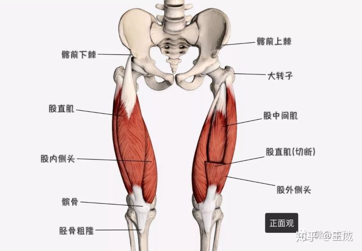
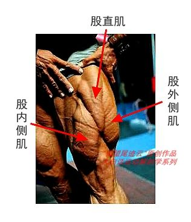
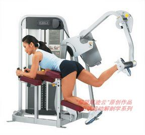
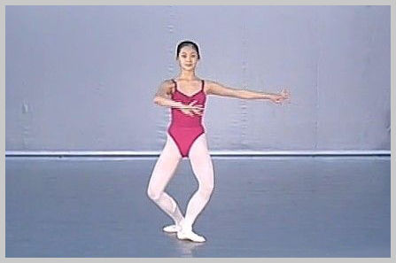
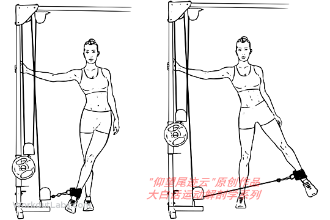
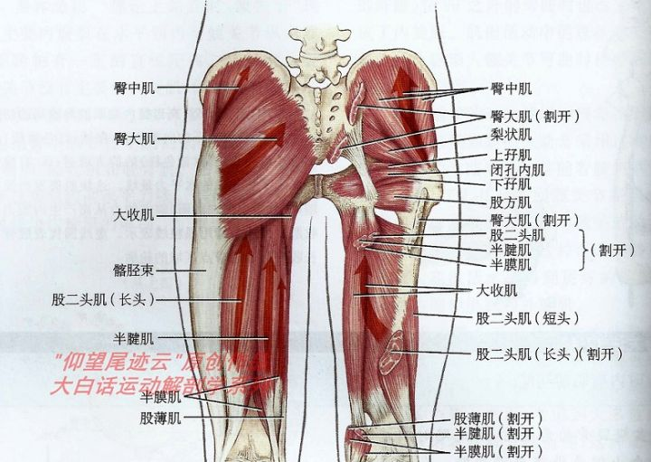
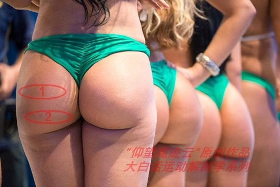
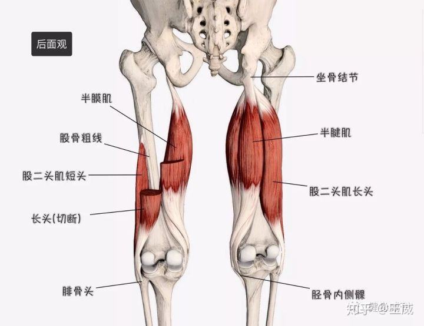
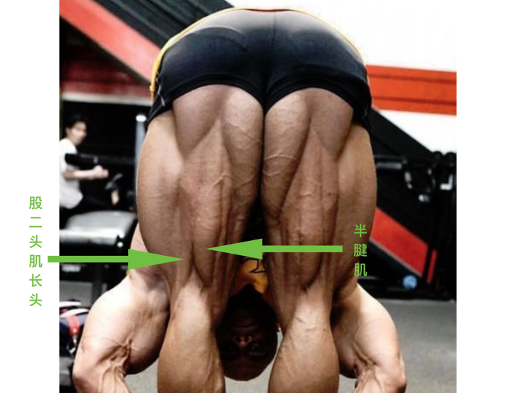
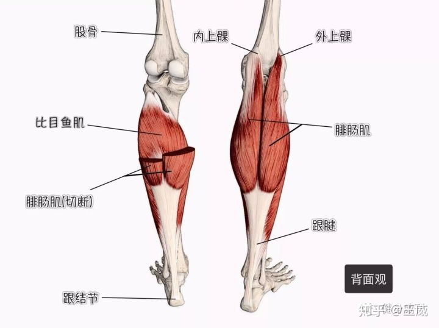

从肌肉的功能与体态，开始介绍动作。

人体肌肉分为心肌、平滑肌与骨骼肌，健身锻炼的就是骨骼肌

# 肌肉体态

人体大部分肌肉是成对的，称为拮抗肌。例如吧普通人前后肌肉力量都是50，人呈现中立位，前面肌肉太紧（拉力大于50）可以导致圆肩驼背，后背肌肉太弱（小于50）也会导致圆肩驼背

# 腿部

腿部肌肉占全身肌肉比例的百分之65以上！所以很多人遇到瓶颈时，加强腿部训练的比例是非常有帮助的。

1. 练腿可以提高生长激素水平及睾酮水平

   生长激素主要用来促进机体生成代谢和蛋白质合成，同时会促进脂肪分解，睾酮则对肌肉生长及力量提升有至关重要的作用。

2. 腿部是人体最大的肌群，而肌肉量是基础代谢的关键，你的肌肉增加了，你的代谢能力也会随之增加，可以更有效的帮助你燃脂。

## 肌肉

### 股四头肌

股四头肌四个头，分别叫股直肌、股中肌、股内侧肌和股外侧肌。其中股中肌在股直肌里面。肱四头肌最重要的功能伸直膝关节，与膕绳肌、腓肠肌等互为对抗肌。其中股直肌连接在骨盆上，所以不仅可以做膝伸，还能协同髂腰肌等完成髋屈（骨盆前倾）的动作。在行走和奔跑时，股直肌向前拉股骨的同时前踢小腿，这是股直肌完美的功能写照。

- 对抗肌肉：膕绳肌、腓肠肌

- 功能：伸直膝关节—股直肌、股中肌、股内侧肌和股外侧肌

  &emsp;&emsp;&emsp;髋屈（骨盆前倾）—股直肌

### 臀大肌

臀大肌很难练圆。臀大肌一收缩，主要的作用，就是让大腿从后面，靠近腰骶部位，也就是腿往后摆。大腿旋外、轻微内收和外展。

臀大肌上部肌肉，倾向于让大腿外展，下部肌肉，倾向于让大腿内收。传统硬拉、或窄脚距的硬拉、和窄脚距的深蹲，理论上说，可能更倾向于训练图中圈1的位置，就是臀大肌上部；相扑硬拉、宽脚距的深蹲，可能更倾向于训练图中圈2的位置，也就是臀大肌下部。但这也是理论上来讲，相关的肌电研究好像还没有。

### 腘绳肌

腘绳肌是一组肌肉，一共有三块：股二头肌（长头）、半膜肌、半腱肌。腘绳肌的主要作用就是两个，伸髋和屈膝。伸髋这个动作，我们讲臀大肌的时候讲过，就是大腿往后摆。臀大肌的主要作用，也是伸髋。所以，训练臀部的动作，也无一例外都会用到腘绳肌。

### 小腿三头肌

实际上就是我们熟悉的腓肠肌和比目鱼肌的总称。腓肠肌主要有快肌纤维构成，下肢快速的弹跳动作，主要由腓肠肌参与。比目鱼肌则主要由慢肌纤维组成，主要负责平时站姿的稳定。

