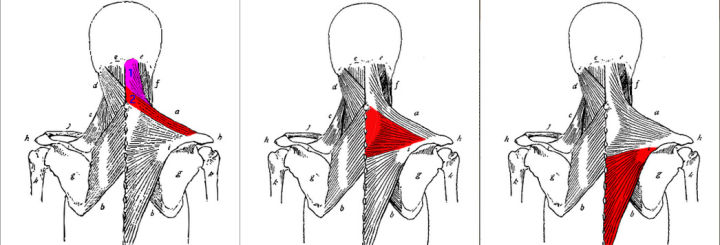
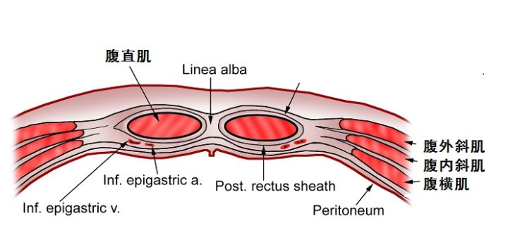

从肌肉的功能与体态，开始介绍动作。

人体肌肉分为心肌、平滑肌与骨骼肌，健身锻炼的就是骨骼肌

# 肌肉体态

人体大部分肌肉是成对的，称为拮抗肌。例如吧普通人前后肌肉力量都是50，人呈现中立位，前面肌肉太紧（拉力大于50）可以导致圆肩驼背，后背肌肉太弱（小于50）也会导致圆肩驼背

# 胸部

## 胸大肌

胸肌包括胸大肌以及胸小肌。胸肌一头连在胳膊上（上臂），一头连在胸骨和锁骨上。所以，胸肌一收紧，就是胳膊靠近胸骨或锁骨。

所有肘部向身体前侧运动，或两肘在身体前侧靠拢的训练动作，都会练到胸肌。可以这样简单理解：平板卧推，着重训练胸肌中部；上斜板，着重训练胸肌上部；下斜板着重训练胸肌下部。

## 前锯肌

前锯肌是好几条，一头连接在肩胛骨上，一头连接在肋骨上。所以我们很容易想到，前锯肌一收缩，就是拽着肩胛骨往前跑。运动解剖学的术语，这个动作叫肩胛骨外展。

所以，有肩膀往前伸的动作，都能练到前锯肌。比如卧推，一般的要求是肩胛骨贴紧长凳。但假如推起杠铃手臂伸直后，肩膀再往上顶，这就训练了前锯肌。很多训练动作，其中包括肩胛骨外展的，都能捎带着训练到前锯肌。前锯肌练好了也很漂亮。

# 背部肌肉

## 背阔肌

背阔肌的作用，就是让上臂靠近脊柱。练习背阔肌的最经典动作就是引体向上。显示背的宽度

**所有上臂向脊柱靠近的训练动作，都能练到背阔肌。**我们看下图，所有针对背阔肌的训练动作（1、2、4、5、6、7），都遵循这一运动轨迹。背阔肌有两个核心动作，一个是下拉（7），一个是划船（5）。几乎所有训练背阔肌的动作，都包含在这两个动作里头。

## 斜方肌

我们看解剖图，斜方肌上白色的部分，就是斜方肌跟骨骼连接的地方。斜方肌一头也连在脊柱上，最上方连在枕骨上（所以脑袋动，也跟斜方肌有关。平常我们说的落枕，其实就多是斜方肌的问题）。斜方肌另一头连在肩胛骨上，所以，斜方肌最基本的作用，就是让肩胛骨靠近脊柱。这个动作，解剖学上叫肩胛骨内收。

- 动头
- 胛骨内收

斜方肌很大，我们看解剖图，会发现肌肉纤维的走向也不一样。所以，斜方肌整体的动作，是夹紧肩胛骨。但斜方肌上的不同部分，分别还有不同的作用。斜方肌一般分成上、中、下三个部分。上部斜方肌，就是我们最熟悉的那个“斜方肌”，脖子上那一块。它的肌纤维走向，是向斜上方。斜上方拉扯肩胛骨，所以，它还有耸肩的作用，这个叫肩胛骨上提。下部斜方肌，肌纤维走向是向斜下方，所以还有沉肩的作用，叫肩胛骨下抑。

斜方肌中、下部，在训练背阔肌的时候，一般能跟着练到。比如划船动作，一般能练到斜方肌整体，尤其是偏中部和上部。下拉动作，常能顺便训练斜方肌下部。

# 腿部

腿部肌肉占全身肌肉比例的百分之65以上！所以很多人遇到瓶颈时，加强腿部训练的比例是非常有帮助的。

1. 练腿可以提高生长激素水平及睾酮水平

   生长激素主要用来促进机体生成代谢和蛋白质合成，同时会促进脂肪分解，睾酮则对肌肉生长及力量提升有至关重要的作用。

2. 腿部是人体最大的肌群，而肌肉量是基础代谢的关键，你的肌肉增加了，你的代谢能力也会随之增加，可以更有效的帮助你燃脂。

## 股四头肌

股四头肌四个头，分别叫股直肌、股中肌、股内侧肌和股外侧肌。其中股中肌在股直肌里面。肱四头肌最重要的功能伸直膝关节，与膕绳肌、腓肠肌等互为对抗肌。其中股直肌连接在骨盆上，所以不仅可以做膝伸，还能协同髂腰肌等完成髋屈（骨盆前倾）的动作。在行走和奔跑时，股直肌向前拉股骨的同时前踢小腿，这是股直肌完美的功能写照。

- 对抗肌肉：膕绳肌、腓肠肌

- 功能：伸直膝关节—股直肌、股中肌、股内侧肌和股外侧肌

  &emsp;&emsp;&emsp;髋屈（骨盆前倾）—股直肌

## 臀大肌

臀大肌很难练圆。臀大肌一收缩，主要的作用，就是让大腿从后面，靠近腰骶部位，也就是腿往后摆。大腿旋外、轻微内收和外展。

臀大肌上部肌肉，倾向于让大腿外展，下部肌肉，倾向于让大腿内收。传统硬拉、或窄脚距的硬拉、和窄脚距的深蹲，理论上说，可能更倾向于训练图中圈1的位置，就是臀大肌上部；相扑硬拉、宽脚距的深蹲，可能更倾向于训练图中圈2的位置，也就是臀大肌下部。但这也是理论上来讲，相关的肌电研究好像还没有。

## 腘绳肌

腘绳肌是一组肌肉，一共有三块：股二头肌（长头）、半膜肌、半腱肌。腘绳肌的主要作用就是两个，伸髋和屈膝。伸髋这个动作，我们讲臀大肌的时候讲过，就是大腿往后摆。臀大肌的主要作用，也是伸髋。所以，训练臀部的动作，也无一例外都会用到腘绳肌。

## 小腿三头肌

实际上就是我们熟悉的腓肠肌和比目鱼肌的总称。腓肠肌主要有快肌纤维构成，下肢快速的弹跳动作，主要由腓肠肌参与。比目鱼肌则主要由慢肌纤维组成，主要负责平时站姿的稳定。

- 踮脚尖—腓肠肌和比目鱼肌
- 屈膝—腓肠肌

# 肱三头肌

三头肌的其它两个头，功能都很简单，就是伸肘，让小臂远离大臂。长头因为连着肩胛骨，所以，除了伸肘，它还有一个小功能，就是参与胳膊靠近肩胛骨。这个动作，解剖学里叫“上臂后伸”

# 肱二头肌

二头肌实际上是跨越两个关节的肌肉，一个是肘关节，一个是肩关节。二头肌的作用，是两种，一个主要，一个次要。肘关节部分是主要作用，就是“屈肘”，让前臂靠近大臂；肩关节部分的作用，是次要作用，就是抬胳膊收胳膊。这部分作用，二头肌短头跟长头还不一样。短头的作用是“参与肩内收”，长头的作用是“参与肩外展”。另外二头肌还有一个“小功能”，就是能让前臂“外旋”

## 进阶

二头肌的最主要作用，是让前臂靠近大臂，就是屈肘。同样，有屈肘作用的肌肉，还有两块，是肱肌和肱桡肌。我们看下面这张图。肱桡肌在前臂上。肱肌在大臂上，二头肌下面藏着。最右侧的图，把二头肌切掉，就看到了肱肌。肱肌和肱桡肌，实际上才是正经的屈肘肌。因为这两块肌肉，都直接连接着前臂和大臂。不像二头肌，实际上是连接着前臂和肩胛骨。

# 肩部

肩部肌肉也叫三角肌，因为从侧面看，有点像个三角形，就是下面这张图。实际上，肩前、中、后三部分，也是一目了然。

# 腹部

**只要是胸部靠近耻骨的力量训练动作，都能练腹肌。**练腹肌（准确的说是练腹直肌，但我们以下都称腹肌）有两个基本动作，一个是卷腹（下图1、2、3），这个动作是耻骨固定，胸部往上靠。一个是举腿（6、7），这个动作是胸部固定，耻骨往胸部靠拢，意思都一样。

## 进阶

腹部肌肉，腹直肌之外，从外到里，是3层，最外面是腹外斜肌，中间是腹内斜肌，最里面是腹横肌。

腹横肌，顾名思义，肌纤维是横着走，相当于一层环状肌肉，把我们的腹部包裹起来。我们平时说的收腹，收缩的就是腹横肌。

腹内斜肌，顾名思义，肌纤维斜着走（向体前侧斜上）。腹内斜肌的功能，跟后面要说的腹外斜肌一样，都是让身体侧屈，或者让躯干回旋。两侧腹内斜肌同时收缩，能让躯干前屈，相当于腹直肌的功能。重点说腹外斜肌，是因为它在最外面，能直接看得见。我们平时说，这人侧腹肌练得不错，说的就是腹外斜肌。即下图红色部分。

